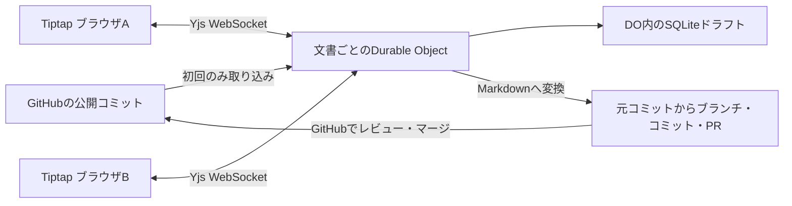

# GitHub-backed Collaborative Markdown CMS PoC

GitHubのMarkdownを閲覧し、Tiptapで共同編集して、編集開始時のコミットを起点とするブランチ／PRを作成するPoCです。Cloudflare Workers + Durable Objects上で動作します。

**ローカル実装・検証済み。残る作業は実アカウントの設定と外部E2E検証です。** ローカルでは固定のサンプルリポジトリを使い、GitHubへの書き込みを模擬します。GitHub Appの実アダプターは実装済みです。

## 起動

Node.js 24以上とnpmを使用します。プロジェクト固有のCLIはすべてローカル依存です。

```bash
npm ci
npm run dev
```

`http://localhost:8787` を開いてください。devcontainerでは8787番ポートを転送します。`npm run dev` はViteで静的ファイルを生成してからWranglerを起動し、実際のworkerdとSQLiteベースのDurable Objectをローカルで動かします。クライアントを変更したら `npm run build:client` またはdevコマンドを再実行してください。WorkerソースはWranglerが監視します。

ローカルのドラフトは `.wrangler/state/` に保存され、プロセスを終了しても残ります。このディレクトリを削除するとローカルドラフトが消えます。初期サンプルは `src/repository.ts` の `fixtures` にあります。

## 共同編集を試す

1. 通常ウィンドウとシークレットウィンドウなど、独立した2つのブラウザセッションを開きます。
2. 両方で同じ文書を選び、**Edit collaboratively** を押します。
3. 両方で入力し、相手側へ自動反映されることを確認します。
4. 一方を一時的にオフラインにして両方で入力し、接続復帰後に両方の変更が残ることを確認します。
5. 再読み込みして再び編集を開くと、公開済み本文ではなくドラフトが復元されます。
6. **Markdown snapshot** で出力を確認し、必要ならダウンロードします。
7. **Prepare pull request** を押します。ローカルでは `Simulated publication` とブランチ名が表示されます。**Published** の内容は変わりません。

未送信の編集はブラウザのメモリにあります。切断中はタブを開いたまま再接続してください。接続前の編集を含むHTTP公開要求や、別ユーザーの変更で内容がずれた公開要求は409で拒否されます。再同期後に内容を確認して再試行できます。

## 検証コマンド

```bash
npm run setup:browser   # ChromiumとLinuxのOS依存をインストール（初回）
npm run verify          # 型・lint・単体テスト・ビルド・ブラウザ・整形チェック
```

| コマンド               | 内容                                                             |
| ---------------------- | ---------------------------------------------------------------- |
| `npm ci`               | lockfileによる再現可能な依存導入                                 |
| `npm run typecheck`    | ブラウザとWorkerを別々の型環境で検査                             |
| `npm run lint`         | ESLint / typescript-eslint                                       |
| `npm test`             | Vitestの境界テスト                                               |
| `npm run build`        | Vite + production Workerのデプロイdry-run。外部認証不要          |
| `npm run test:e2e`     | クライアントをビルドし、8790番でWranglerを起動してPlaywright実行 |
| `npm run format:check` | Prettierチェック                                                 |
| `npm run dev`          | 8787番のローカルWorker／Durable Object                           |
| `npm run deploy`       | production環境への実デプロイ。外部設定後に実行                   |

ブラウザテストは毎回専用の `.wrangler/browser-*` を作り、通常のローカルドラフトを変更しません。独立コンテキスト間の同期、切断中の同時編集、再読み込み、全クライアントを閉じた後のWorker再起動、Markdown出力、公開結果の永続化を検証します。`artifacts/collaboration.png` と `artifacts/worker-browser.log` を生成します。失敗時は `test-results/` にトレースが残ります。

## 構成と所有権



- 公開済み文書の正本はGitHubです。閲覧は設定ブランチの最新コミットから読み込みます。
- 部屋名はowner/repository/full-pathの可逆エンコードです。同じファイル名でもディレクトリが違えば別の部屋になります。
- 初期化はサーバーだけが実行します。GitコミットSHAを確定してから同じSHAのファイルを読み込み、Tiptap JSONからYjsへ変換します。初回の同時接続で本文を二重挿入しません。
- 元コミット・blob SHA・対象ブランチ・元ソースはクライアントが編集できるCRDTの外に保存します。本文はY.XmlFragment、front matterはY.Textです。
- 各Yjs更新時にSQLiteの1行へ完全な状態を保存します。DOの出力ゲートが永続化を保護します。y-partyserverの保存フックも補助的に使います。presenceは永続化しません。
- D1、R2、独立したCMS DB、独自CRDTは使いません。SQLiteはそのDurable Objectのドラフト保存機能です。

## Markdown対応

見出し、段落、箇条書き、番号付きリスト、リンク、インラインコード、言語指定付きコードフェンスを往復テストしています。太字・斜体も対応します。YAML front matterは改行・コメントを含めてそのまま維持し、UIでは読み取り専用です。

TiptapのMarkdown機能はbetaです。空白、リストの表記、フェンスなどは正規化されます。テーブル、画像、タスクリスト、HTML、MDX、脚注、独自ディレクティブの可逆変換は保証しません。これらは表示できても編集時に失われる場合があります。生成されたMarkdownの確認／ダウンロードを用意していますが、raw Markdownを直接共同編集する機能はありません。相対Markdownリンクで文書間を移動できます。リポジトリ画像配信は対象外です。

## GitHub公開

GitHub Appのinstallation tokenをサーバーだけで取得します。PATは使いません。

1. ブラウザが期待する本文とサーバーの現在のMarkdownが一致することを確認します。
2. path・元コミット・MarkdownのSHA-256から `cms/<hash>` を決定します。
3. **元コミットのtree**を使ってその1ファイルの変更treeを作り、**元コミットだけを親**にするコミットを作ります。
4. 新ブランチを作り、元の対象ブランチへPRを開きます。
5. 結果をドラフトに記録します。同じ内容の再実行は同じ結果になります。RESTの途中失敗後も既存ブランチ／PRを検索して再開します。

外部でブランチが進んでもbase SHAを差し替えません。競合判定・解決・マージはGitHubに任せます。default branchへの直接書き込みはありません。

PoCではPR作成後もドラフトを保持し、変更したスナップショットは別PRになります。既存PRの更新、マージ通知、ドラフトの自動破棄／新baseへの切替は実装していません。設定ブランチを既存ドラフトの途中で切り替えないでください。長期運用のセッション管理は次段階です。

## 実アカウントへの接続

[外部連携手順](docs/external-integration.md)に、GitHub Appの権限、秘密鍵形式、Wrangler secrets、Cloudflare Access、デプロイ、最後の2ブラウザ検証をまとめています。

productionはCloudflare Access JWTの検証を必須とし、未設定なら401で閉じます。独自ユーザーDB／ログイン機構はありません。許可された利用者は設定リポジトリの全Markdownを編集・PR化できます。ドキュメント単位のACLは対象外です。認証なしのfixture環境はローカルデモ専用です。

## ファイル案内・判断記録

| ファイル               | 役割                                              |
| ---------------------- | ------------------------------------------------- |
| `src/worker.ts`        | HTTP／WebSocketルーティング、ドラフト永続化、公開 |
| `src/repository.ts`    | GitHub App RESTアダプターとfixture                |
| `src/markdown.ts`      | MarkdownとYjs変換・front matter・部屋名           |
| `src/access.ts`        | Cloudflare Access JWT検証                         |
| `src/client.ts`        | ディレクトリ閲覧・Tiptap編集UI                    |
| `docs/architecture.md` | 調査した候補・採用理由・制限                      |
| `docs/handouts/`       | 作業経過・判断・再開用ハンドアウト                |
| `docs/requirements.md` | 元の要件全文                                      |

Node 24.21.0 / npm 11.19.0で検証しました。依存バージョンはlockfileに固定しています。y-partyserverのworkers-types peer宣言がv4のため、現在のWranglerに合わせてv5へoverrideしています。型検査・実workerdでの検証を通して使用しています。
